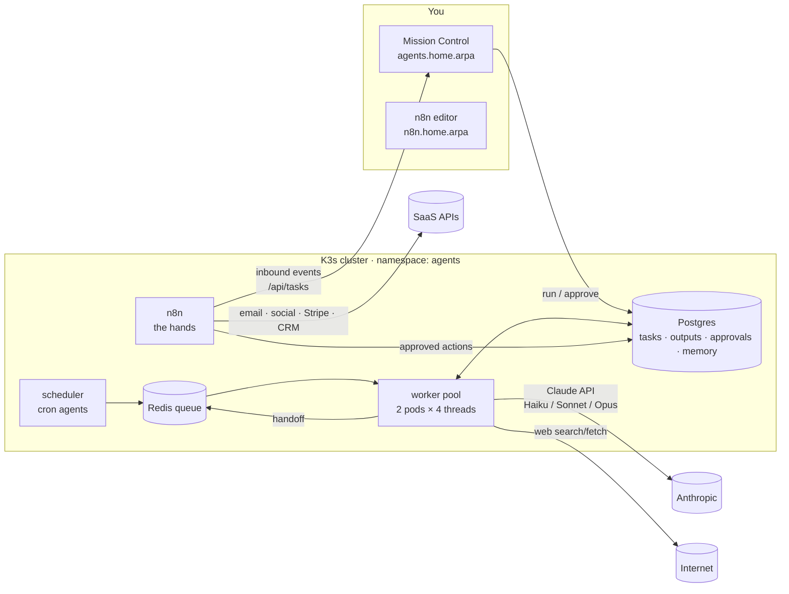

# AgentOS Blueprint: a 40-agent AI studio on two OptiPlex Micros

The goal is a system where **AI agents do most of the work** and you spend **30 to 60 minutes a day**
approving, selling, and steering, with a clear path to **$10k/month**.

This document covers the business plan, the team, the architecture, the costs, and the roadmap.
For the hardware, see [PROXMOX-PLAN.md](PROXMOX-PLAN.md). To deploy, see [DEPLOY.md](DEPLOY.md).
**Start with [60-DAY-SPRINT.md](60-DAY-SPRINT.md)**, which covers the first two months: fast cash
through freelance work and local clients, with deposits upfront.

---

## 1. Reality check: what is behind the "$10k/month with Claude" stories

Read this first, because it shapes every decision below.

| What people say | What's usually true |
|---|---|
| "My AI agents make money while I sleep" | Agents do the *labor*: research, drafting, building, reporting. **A human still sells, approves, and owns the client.** The income comes from selling a service or product. |
| "$10k in month one" | Survivorship bias. The repeatable stories take **4 to 12 months**, and they come from people who picked one niche and one offer and did sales every week. Many people never get there. |
| "Faceless AI content farms" | Increasingly dead ends. YouTube's monetization rules target mass-produced and repetitive content, and Google's spam policies target scaled low-value content. |
| "Mass automated DMs and cold email" | Gets accounts banned and domains blacklisted, and can break CAN-SPAM, GDPR, and platform terms. Low-volume, highly personal, human-approved outreach is what works. |

The models that repeatably reach $10k all **sell outcomes to businesses** and use AI to deliver them at
a fraction of the old labor cost:

1. **AI automation services ("AI automation agency")**: speed-to-lead responders, missed-call text-back,
   appointment reminders, review follow-up, document intake. Setup fee plus monthly retainer.
   *The most direct path to $10k.*
2. **Freelance development with Claude Code**: fixed-price builds on Upwork, Contra, or through referrals.
   Fast first dollars, but you trade time for money.
3. **Build-in-public content, then products**: an audience that buys templates and kits and refers
   clients. Slow to start, compounds over time.
4. **Micro-SaaS**: productize the one automation every client keeps asking for. Highest ceiling,
   slowest start. Only after #1 shows you what people will pay for.

Your edge is that you already run Proxmox, K3s, pfSense, and Wazuh. That makes you credible to sell
"secure, self-hosted AI automation," and the homelab itself becomes your best content.

---

## 2. The strategy: three engines, in sequence

```
Month:      0    1    2    3    4    5    6    7    8    9
Engine 1  [===== AI automation services (cash engine) ===========>]
Engine 2       [==== build-in-public content (lead engine) ======>]
Engine 3                      [==== templates, kits, micro-SaaS ==>]
```

### Engine 1: AI automation services (start here)

Pick **one niche** (the `niche-researcher` agent helps you choose). Good fits: home services (HVAC,
plumbing, roofing), dental and med-spa clinics, real estate teams, law firms, auto repair. These are
businesses where one missed lead costs hundreds of dollars.

**Productized offer (example):**

| Tier | What they get | Price |
|---|---|---|
| Starter | Instant lead response: web form or missed call, then an AI text/email reply in under 60 seconds, then booking link | $1,500 setup + $400/mo |
| Growth | Starter + appointment reminders + review-request flow + monthly ROI report | $2,500 setup + $750/mo |
| Custom | Back-office automation (intake, document processing, CRM sync) | $4,000+ setup + $1,000+/mo |

The retainer covers hosting, monitoring, prompt tuning, and one small change a month. **Client
automations run on a small cloud VM or in the client's own accounts, never on your homelab.** A
residential connection and two Micros can't promise uptime to a paying business. The homelab is
your **factory**: agents, R&D, and staging.

### Engine 2: build-in-public content (start in month 1-2)

Theme: *"I run a 40-agent AI company on two tiny computers in my house."* YouTube and LinkedIn, plus a
weekly newsletter. Every piece comes from real work, and the agents turn that work into scripts and
posts. This brings in inbound leads for Engine 1 and buyers for Engine 3.

### Engine 3: products (month 4+)

- **AgentOS homelab kit**: this repository, packaged with docs and video walkthroughs ($49-$149).
- **n8n workflow packs** for your niche ($29-$99).
- **Micro-SaaS**: when 3+ clients pay for the same automation, turn it into self-serve software.

---

## 3. The $10k math

### Month-6 target mix

| Source | Volume | Price | Monthly |
|---|---|---|---|
| Retainers | 6 clients | $750 avg | $4,500 |
| New setups | 2 per month | $2,000 avg | $4,000 |
| Templates and kits | ~25 sales | $60 avg | $1,500 |
| **Total** | | | **$10,000** |

Scenarios for month 6: **conservative ≈ $3k** (3 retainers + 1 setup), **target ≈ $10k**,
**stretch ≈ $15k** (10 retainers + higher-tier setups).

### The funnel that feeds it (what the agents scale)

To close **2 new clients a month**:

```
~330 personalized emails/month (15/weekday, lead-sourcer → enricher → outreach-writer)
  → ~3% positive replies             ≈ 10 conversations
  → ~80% book a call                 ≈ 8 discovery calls (discovery-prep briefs you)
  → ~25% close                       ≈ 2 new clients (proposal-writer drafts the proposal)
  + inbound from content (grows over time, cuts the outreach needed)
```

These rates are planning assumptions, not promises. The `kpi-analyst` agent tracks the real ones
weekly, and you adjust from there.

---

## 4. The team: 40 agents in 9 departments

You are the **CEO**. You approve, sell, and own relationships. The agents do everything else.

Agents unlock in **phases** so you don't pay for a delivery team before you have a client:

- **Phase 1 (week 1): 15 agents.** Research, pipeline, outreach, freelance bids, proposals, content planning.
- **Phase 2 (first paying client): +19.** Delivery, client success, finance, ops.
- **Phase 3 (month 4+): +6.** Products, SEO, competitive intel, cost tuning.

Change phases with one setting (`AGENTOS_PHASE` in `apps/agent-platform/kustomization.yaml`).

| # | Agent | Dept | Phase | Model | Runs | Job |
|---|---|---|---|---|---|---|
| 1 | `chief-of-staff` | Command | 1 | sonnet | weekdays 07:05 | Daily briefing, routes work, keeps your decisions under 15 min/day |
| 2 | `strategist` | Command | 1 | opus | Mon 06:35 | Weekly plan to $10k: what to double down on, what to kill |
| 3 | `quality-reviewer` | Command | 1 | sonnet | on demand | Checks every draft before it reaches your approval queue |
| 4 | `compliance-officer` | Command | 1 | sonnet | on demand | CAN-SPAM, FTC, and platform rules check on outreach and content |
| 5 | `trend-scout` | Market intel | 1 | sonnet + web | weekdays 06:10 | Daily 7-bullet brief: tools, pricing, and policy changes that matter |
| 6 | `niche-researcher` | Market intel | 1 | sonnet + web | Tue 06:20 | Picks and deep-dives the target niche: pains, prices, objections |
| 7 | `competitor-watch` | Market intel | 3 | sonnet + web | Thu 06:20 | Competitor offers and pricing, plus ways to differentiate |
| 8 | `opportunity-scorer` | Market intel | 3 | haiku | on demand | Scores new ideas on demand, speed to cash, fit, and risk |
| 9 | `lead-sourcer` | Sales | 1 | sonnet + web | weekdays 08:05 | 15 well-matched businesses/day from public sources |
| 10 | `lead-enricher` | Sales | 1 | sonnet + web | on demand | Finds the specific detail each first email will reference |
| 11 | `lead-qualifier` | Sales | 2 | haiku | on demand | Grades leads A/B/C against your ideal customer profile |
| 12 | `outreach-writer` | Sales | 1 | sonnet | on demand | Personal first-touch email + 2 follow-ups, batched for approval |
| 13 | `inbox-triage` | Sales | 1 | haiku | on demand | Sorts replies, drafts answers, handles unsubscribes |
| 14 | `discovery-prep` | Sales | 1 | sonnet + web | on demand | One-page brief + ROI estimate before every sales call |
| 15 | `proposal-writer` | Sales | 1 | opus | on demand | Signable 3-tier proposal from your call notes |
| 16 | `freelance-bidder` | Sales | 1 | sonnet | on demand | Scores job posts, drafts bids (you submit them by hand) |
| 17 | `solutions-architect` | Delivery | 2 | opus | on demand | Build plan, security, hosting, tests, runbook |
| 18 | `workflow-builder` | Delivery | 2 | sonnet | on demand | Importable n8n workflows with retries and logging |
| 19 | `code-builder` | Delivery | 2 | opus | on demand | Custom code with tests (you commit it with Claude Code) |
| 20 | `prompt-engineer` | Delivery | 2 | sonnet | on demand | Prompts inside client automations, with test cases |
| 21 | `qa-tester` | Delivery | 2 | sonnet | on demand | Test plan + PASS or a defect list |
| 22 | `docs-writer` | Delivery | 2 | haiku | on demand | Client handover docs + Loom script |
| 23 | `onboarding-coordinator` | Delivery | 2 | haiku | on demand | Onboarding checklist and access requests |
| 24 | `client-health` | Client success | 2 | haiku | on demand | Morning check of every client automation |
| 25 | `report-writer` | Client success | 2 | sonnet | monthly (1) 08:05 | Monthly ROI report per client (drives renewals) |
| 26 | `support-desk` | Client success | 2 | haiku | on demand | Drafts support replies, escalates real problems |
| 27 | `content-strategist` | Content | 1 | sonnet + web | Mon 07:20 | Weekly content plan built from real work |
| 28 | `video-scriptwriter` | Content | 1 | sonnet | on demand | YouTube scripts, titles, thumbnail concepts |
| 29 | `longform-writer` | Content | 2 | sonnet | on demand | Blog posts and case studies (with permission) |
| 30 | `shortform-repurposer` | Content | 2 | haiku | on demand | LinkedIn/X/Shorts posts from long pieces |
| 31 | `newsletter-editor` | Content | 2 | sonnet | Fri 10:05 | Weekly newsletter for your owned audience |
| 32 | `seo-optimizer` | Content | 3 | sonnet + web | on demand | Honest on-page SEO |
| 33 | `product-builder` | Products | 3 | opus | on demand | Templates and kits from repeatable work |
| 34 | `listing-copywriter` | Products | 3 | sonnet | on demand | Product pages and price tests |
| 35 | `bookkeeper` | Finance | 2 | haiku | monthly (2) 09:05 | Monthly P&L draft and tax set-aside |
| 36 | `collections` | Finance | 2 | haiku | on demand | Polite overdue-invoice reminders |
| 37 | `kpi-analyst` | Finance | 2 | sonnet | Sun 18:05 | Weekly scoreboard; flags agents not worth their cost |
| 38 | `sre-watchdog` | Platform | 2 | haiku | on demand | Diagnoses homelab alerts and hands you exact commands |
| 39 | `security-auditor` | Platform | 2 | sonnet | Sat 08:05 | Weekly check for spend spikes, injection, odd behavior |
| 40 | `cost-optimizer` | Platform | 3 | haiku | daily 23:05 | Nightly spend review with tuning suggestions |

Full prompts, budgets, and handoff rules live in
[`apps/agent-platform/roster.yaml`](../../apps/agent-platform/roster.yaml). To add an agent, add a YAML
block and re-apply. No code changes needed.

### Your daily routine (30-60 minutes)

1. **7:15**: read the chief-of-staff briefing in Mission Control (`http://agents.home.arpa`).
2. Clear the **approval queue**: outreach batches, replies, proposals, posts. Approve, reject, or edit.
3. Take any **sales calls**; paste your call notes into `proposal-writer`.
4. **Weekly**: read the strategist's Monday plan and the kpi-analyst's Sunday scoreboard. Record one
   video from the script.

---

## 5. How it works



**Design rules that keep it cheap, safe, and fast:**

- **Agents are config, not processes.** 40 agents share a pool of worker pods that run whichever task
  is next. Idle agents cost $0 and 0 MB of RAM.
- **Brains and hands are separate.** Agents (the brains) have *no* credentials for email, social, or
  payments. They file approval requests. After you approve, n8n (the hands) executes them. A
  prompt-injected web page can't make an agent send an email or spend money.
- **Right model for the job.** Haiku for triage and formatting, Sonnet for most writing and research,
  Opus only for proposals, architecture, and code.
- **Budgets at three levels:** per-agent daily caps (in the roster), a global daily cap
  (`GLOBAL_DAILY_BUDGET_USD`), and a monthly spend limit you set in the Anthropic Console.
- **Kill switch.** "Pause everything" in Mission Control stops all new work immediately.
- **Prompt caching.** Each agent's system prompt is stable, so repeat runs get cache discounts when the
  prompt is long enough to qualify.
- **Shared memory.** Agents `remember` lessons and `recall` them later, so the team learns what converts.
- **Locked-down network.** The `agents` namespace can reach the internet but not your home LAN, and
  nothing reaches it except through Traefik.

### Wiring n8n (the hands)

| n8n workflow | Trigger | Does |
|---|---|---|
| Execute approvals | Every 2 min, Postgres query `approvals WHERE status='approved' AND executed_at IS NULL` | Switch on `action` → Gmail/SMTP send, LinkedIn/X post, Stripe invoice → set `executed_at` |
| Inbound replies | Gmail/IMAP trigger (polling, so no public URL needed) | POST to `http://agentos-console/api/tasks` → `inbox-triage` |
| Client metrics | Daily 06:30 | Collect run stats from client n8n instances → `client-health` |
| Homelab alerts | Wazuh / Uptime Kuma webhook | → `sre-watchdog` / `security-auditor` |
| Transactions | Monthly | Stripe + bank CSV → `remember` / `bookkeeper` |

---

## 6. What it costs

### One-time

| Item | Cost |
|---|---|
| RAM upgrade so each Micro has 32 GB or more (see the Proxmox plan) | $60-150 |
| Small UPS for both Micros + switch | $80-150 |
| Raspberry Pi or other always-on box as a Proxmox QDevice (fixes 2-node quorum) | $0-60 |
| LLC formation + business bank account (varies by state) | $50-500 |

### Monthly

| Item | Phase 1 | Phase 2-3 |
|---|---|---|
| Claude API (agents) | $40-100 | $150-300 |
| Your own Claude plan for building with Claude Code | $20-200 | $20-200 |
| Domains (main + separate outreach domain) | ~$3 | ~$3 |
| Google Workspace (2 inboxes) | ~$15 | ~$15 |
| Cold-email sending and warmup tool (or Gmail at low volume) | $0-40 | $40 |
| Cloud VMs for client automations | $0 | $5-20 per client (billed to them) |
| Offsite backups (Backblaze B2 or similar) | ~$2 | ~$5 |
| Electricity for two Micros (~30-40 W) | ~$5 | ~$5 |
| **Total** | **≈ $85-405** | **≈ $250-600** |

Everything else is free and self-hosted: n8n, Postgres, Redis, K3s, Proxmox, Wazuh, and Cal.com's free tier.
Stripe takes about 2.9% + 30¢ per payment.

---

## 7. What you need (checklist)

**Accounts**
- [ ] Anthropic Console account + API key, **with a monthly spend limit set**
- [ ] Business domain + Google Workspace (`you@studio.com`)
- [ ] A **separate** outreach domain (`trystudio.com`) with SPF, DKIM, and DMARC set up, warmed for 2-3 weeks before sending
- [ ] Stripe (invoices and subscriptions), Cal.com (booking link)
- [ ] YouTube channel + LinkedIn page + newsletter (Beehiiv, Kit, or Substack)
- [ ] GitHub Container Registry (already available through this repo)

**Business basics**
- [ ] LLC + business bank account + accounting (Wave or QuickBooks)
- [ ] Contract template: scope, payment terms, data handling, liability cap. Have a lawyer review it once.
- [ ] Set aside about 25-30% of income for taxes, and confirm with an accountant.

**Skills you'll practice weekly** (agents can't do these for you)
- [ ] Sales calls: listen for the expensive problem, then propose the smallest fix that solves it
- [ ] Saying no to off-niche work
- [ ] Recording one video a week on camera

---

## 8. 90-day roadmap

| Week | Build | Business |
|---|---|---|
| 0 | Fix the cp01 disk, clean up Proxmox, RAM and QDevice ([PROXMOX-PLAN.md](PROXMOX-PLAN.md)) | Register domains, start inbox warmup, form the LLC |
| 1 | Deploy AgentOS phase 1 ([DEPLOY.md](DEPLOY.md)); first briefings | Niche decision with `niche-researcher` + `strategist` |
| 2 | n8n "execute approvals" + "inbound replies" workflows | Build **your own** demo: a speed-to-lead bot for a fake business in your niche (portfolio piece + content) |
| 3-4 | Tune prompts from what you approve and reject | Outreach starts: 10-15/day. First video: "My 40-agent AI company on two OptiPlex Micros" |
| 5-6 | Client-hosting template (n8n on a $6-12 VPS, set up from a script) | First discovery calls. Offer the first 2 clients a discounted setup in exchange for a case study |
| 7-8 | **Phase 2**: delivery + success agents | Deliver client #1; monthly report; ask for a referral |
| 9-12 | Tighten the funnel numbers from the kpi-analyst | 3-5 clients; weekly content; raise prices for new clients |
| Month 4+ | **Phase 3**: products | Package the AgentOS kit + workflow packs |

## 9. Scoreboard (kpi-analyst tracks this weekly)

| Metric | Week-12 target |
|---|---|
| MRR (retainers) | $2,000+ |
| Emails sent / positive reply rate | 300/mo / ≥ 3% |
| Discovery calls / close rate | 6-8/mo / ≥ 25% |
| Approval rate of agent drafts (approved without edits) | ≥ 70% (lower means prompts need work) |
| AI spend as % of revenue | ≤ 10% |
| Your daily time in Mission Control | ≤ 60 min |

## 10. Risks and guardrails

| Risk | Guardrail |
|---|---|
| Runaway API spend | Per-agent caps, global cap, Console limit, nightly `cost-optimizer` |
| Prompt injection from web pages | Agents hold no outbound credentials; everything external goes through approval; egress-only network policy; weekly `security-auditor` |
| Email domain burned | Separate outreach domain, low volume, personal emails, opt-out handling, warmup |
| Homelab outage takes down clients | Client automations never run on the homelab |
| Hallucinated claims in sales or content | House rule: cite or don't claim; `quality-reviewer` pass; you approve everything |
| One node dies | QDevice for quorum, nightly vzdump backups, nightly Postgres dump (`backup.yaml`), offsite copy |
| Burnout from too many offers | One niche, one offer, until it makes $5k/month |
